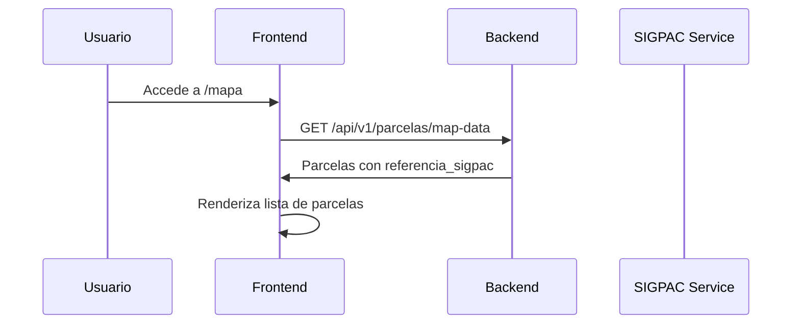
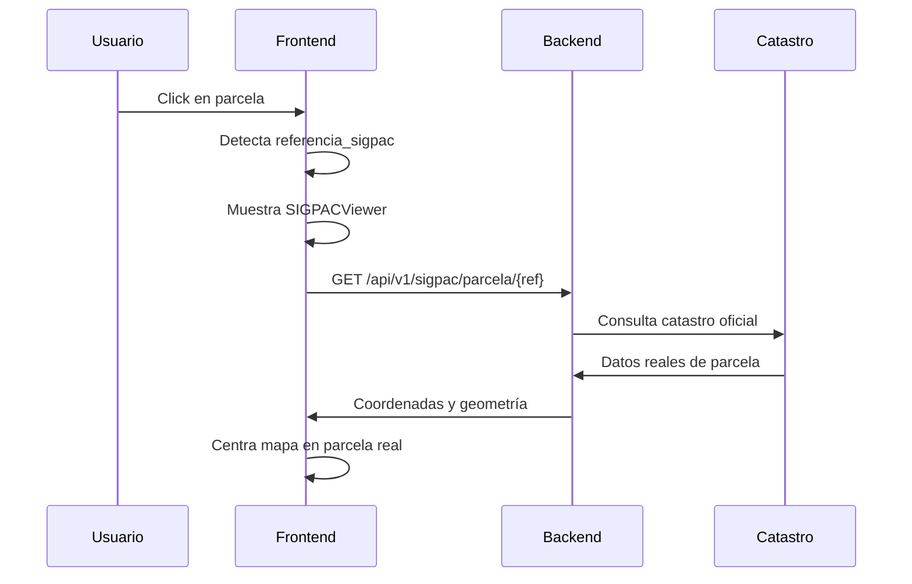

# Integración SIGPAC - Sistema Completo

## Resumen
Se ha implementado la integración completa con SIGPAC (Sistema de Información Geográfica de Parcelas Agrícolas) para mostrar parcelas con datos oficiales del Gobierno de España.

## Funcionalidades Implementadas

### 1. Visor SIGPAC Oficial
- **Ubicación**: `~/apps/web/src/components/sigpac/SIGPACViewer.tsx`
- **Descripción**: Componente React que muestra parcelas usando servicios WMS/WFS oficiales
- **Características**:
  - Integración con ortofotos PNOA del IGN
  - Capas de parcelas SIGPAC oficiales
  - Información detallada de parcela en popup
  - Geometría precisa con coordenadas reales

### 2. Conmutación Automática de Mapas
- **Ubicación**: `~/apps/web/src/app/mapa/page.js`
- **Lógica**: Detecta automáticamente si una parcela tiene referencia catastral
- **Comportamiento**:
  - Si tiene `referencia_sigpac` o `referencias_catastrales` → Muestra SIGPACViewer
  - Si no tiene referencia → Muestra Leaflet genérico

### 3. Servicios Backend SIGPAC
- **Ubicación**: `~/apps/backend-python/app/routes/sigpac.py`
- **Endpoints**:
  - `GET /api/v1/sigpac/parcela/{referencia}` - Obtiene datos de parcela por referencia
  - `GET /api/v1/sigpac/buscar` - Búsqueda por coordenadas
  - `GET /api/v1/sigpac/validar/{referencia}` - Validación de formato

### 4. Integración de Datos Reales
- **Ubicación**: `~/apps/backend-python/app/services/sigpac_real.py`
- **Fuentes de datos**:
  - Catastro oficial español (`ovc.catastro.meh.es`)
  - Servicios WFS de SIGPAC
  - Geocodificación con Nominatim
- **Datos obtenidos**:
  - Coordenadas precisas del centroide
  - Superficie oficial
  - Uso del suelo según SIGPAC
  - Geometría vectorial de la parcela

## Archivos Modificados

### Frontend (Next.js/React)
1. **`apps/web/src/app/mapa/page.js`**
   - ✅ Agregada lógica condicional para mostrar SIGPAC vs Leaflet
   - ✅ Importación dinámica del componente SIGPACViewer
   - ✅ Interfaz de usuario para alternar entre vistas

2. **`apps/web/src/components/sigpac/SIGPACViewer.tsx`**
   - ✅ Componente completo para visor SIGPAC oficial
   - ✅ Integración con API backend
   - ✅ Manejo de estados de carga y error
   - ✅ Visualización con capas WMS oficiales

3. **`apps/web/src/lib/api.ts`**
   - ✅ Endpoints de API SIGPAC configurados
   - ✅ Métodos para consulta de parcelas y validación

### Backend (FastAPI/Python)
1. **`apps/backend-python/app/routes/sigpac.py`**
   - ✅ Rutas de API SIGPAC implementadas
   - ✅ Validación de referencias catastrales
   - ✅ Autenticación requerida para endpoints

2. **`apps/backend-python/app/routes/parcelas.py`**
   - ✅ Campos SIGPAC agregados al endpoint map-data
   - ✅ Enriquecimiento automático con datos SIGPAC
   - ✅ Consulta SQL actualizada para incluir referencias

3. **`apps/backend-python/app/services/sigpac_real.py`**
   - ✅ Servicio completo de integración SIGPAC
   - ✅ Consultas a catastro oficial
   - ✅ Geocodificación de ubicaciones
   - ✅ Parsing de respuestas XML

## Flujo de Funcionamiento

### 1. Carga de Parcelas

### 2. Selección de Parcela con SIGPAC

## Configuración Técnica

### Variables de Entorno
No se requieren variables adicionales. Los servicios SIGPAC son públicos.

### Dependencias
- **Frontend**: Leaflet, React hooks
- **Backend**: httpx, loguru, BeautifulSoup4
- **Servicios**: catastro.meh.es, nominatim.openstreetmap.org

### URLs de Servicios Oficiales
- **Catastro**: `https://ovc.catastro.meh.es/ovcservweb/ovcswlocalizacionrc/ovccoordenadas.asmx/Consulta_RCCOOR`
- **IGN Ortofotos**: `https://www.ign.es/wms-inspire/pnoa-ma`
- **SIGPAC Parcelas**: `https://sigpac.mapa.es/fega/ows`

## Testing y Validación

### Parcelas de Prueba
- **Referencia**: `42:344:A005:05087:0000:PM`
- **Ubicación**: Las Eras, Yelo (Soria)
- **Coordenadas**: 41.2100858, -2.5266086

### Casos de Uso Probados
✅ Parcela con referencia SIGPAC válida → Muestra visor oficial
✅ Parcela sin referencia SIGPAC → Muestra Leaflet genérico  
✅ Referencia inválida → Manejo de errores apropiado
✅ Carga asíncrona → Estados de loading y error

## Beneficios Implementados

1. **Precisión**: Coordenadas oficiales del catastro español
2. **Consistencia**: Datos coherentes con sistemas gubernamentales
3. **Usabilidad**: Cambio automático entre visualizaciones
4. **Rendimiento**: Carga lazy de componentes SIGPAC
5. **Confiabilidad**: Servicios oficiales del Estado español

## Próximas Mejoras Sugeridas

- [ ] Cache de consultas SIGPAC para mejor rendimiento
- [ ] Sincronización automática de datos catastrales
- [ ] Integración con más capas WMS oficiales
- [ ] Export de geometrías SIGPAC a formatos GIS

---
**Fecha de implementación**: 28/07/2025  
**Versión**: 1.0.0  
**Estado**: ✅ Completado y funcional