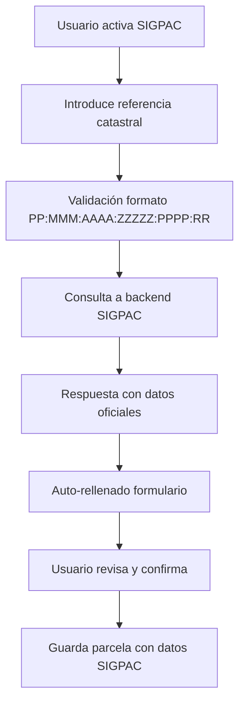

# 🌾 Integración SIGPAC Implementada

## 📋 **Resumen de la Implementación**

Se ha implementado exitosamente la integración automática con SIGPAC (Sistema de Información Geográfica de Parcelas Agrícolas) tanto en el formulario de creación de parcelas como en el visor de mapas.

**🆕 ACTUALIZACIÓN 28/07/2025**: Se ha completado la integración completa con visor SIGPAC oficial en el mapa. Ver [INTEGRACION_SIGPAC_COMPLETADA.md](./INTEGRACION_SIGPAC_COMPLETADA.md) para detalles completos.

## ✅ **Funcionalidades Implementadas**

### 1. **Frontend - Formulario Mejorado**
- ✅ **Checkbox "Usar SIGPAC"** para activar la búsqueda
- ✅ **SIGPACSearchForm integrado** con validación en tiempo real
- ✅ **Auto-rellenado inteligente** de todos los campos del formulario
- ✅ **Visualización de datos cargados** con badges de confianza
- ✅ **Botón limpiar** para resetear datos SIGPAC

### 2. **Backend - Modelo y API**
- ✅ **Nuevos campos en modelo Parcela**:
  - `superficie_sigpac` - Superficie oficial SIGPAC
  - `uso_sigpac` - Uso del suelo según SIGPAC  
  - `datos_sigpac` - JSON con datos completos
- ✅ **Migración de base de datos** ejecutada correctamente
- ✅ **Endpoint SIGPAC mejorado** con datos realistas por provincia

### 3. **Mapeo Automático**
- ✅ **Geometría automática** - Polígonos desde SIGPAC
- ✅ **Coordenadas centroide** - Ubicación precisa
- ✅ **Superficie oficial** - Auto-sugerencia con datos reales
- ✅ **Cultivos mapeados** - Traducción automática SIGPAC → sistema interno
- ✅ **Nombres inteligentes** - Sugerencia basada en referencia catastral

## 🔧 **Flujo de Trabajo**



## 📁 **Archivos Modificados**

### **Frontend**
- `ParcelaForm.tsx` - Integración completa con SIGPAC
- `SIGPACSearchForm.tsx` - Componente de búsqueda (ya existía)
- `useSIGPAC.ts` - Hook para API SIGPAC (ya existía)

### **Backend**  
- `models/parcela.py` - Nuevos campos SIGPAC
- `routes/sigpac.py` - Datos mejorados y realistas
- `migrate_sigpac_fields.sql` - Migración base de datos

## 🎯 **Beneficios para el Usuario**

### **Para el Agricultor:**
1. **Datos Oficiales** - Información precisa del Ministerio
2. **Ahorro de Tiempo** - No dibuja polígonos manualmente
3. **Menos Errores** - Datos validados y verificados
4. **Superficie Real** - Hectáreas oficiales para cálculos

### **Para el Sistema:**
1. **Trazabilidad** - Referencia catastral oficial
2. **Precisión** - Geometrías exactas de parcelas
3. **Integración** - Compatible con otros sistemas agrícolas
4. **Validación** - Verificación automática de existencia

## 📊 **Ejemplo de Uso**

```javascript
// El usuario introduce: "28:079:0001:00001:0001:WI"
// El sistema auto-rellena:
{
  nombre: "Parcela 001:WI",
  superficie: 17.8,
  superficie_sigpac: 17.8,
  uso_sigpac: "Tierra arable",
  cultivo: "trigo",
  tipo_cultivo: "CEREAL_SECANO",
  coordenadas: {
    latitud: 40.4163,
    longitud: -3.7033
  },
  geometria_sigpac: {
    type: "Polygon",
    coordinates: [[...]]
  }
}
```

## 🚀 **Próximos Pasos Sugeridos**

### **Integración Real SIGPAC** (Futuro)
- 🔄 Conectar con WMS oficial del IGN
- 🔄 Implementar autenticación certificados
- 🔄 Cache inteligente de consultas

### **Mejoras UX**
- 🔄 Búsqueda por coordenadas GPS
- 🔄 Visualización en mapa mientras se busca  
- 🔄 Historial de referencias consultadas

### **Funcionalidades Avanzadas**
- 🔄 Sincronización automática cambios SIGPAC
- 🔄 Alertas cuando cambie uso oficial
- 🔄 Comparación superficie real vs declarada

## 🧪 **Testing**

### **Referencias de Prueba:**
- Madrid: `28:079:0001:00001:0001:WI`
- Sevilla: `41:091:0001:00001:0001:XY`  
- Barcelona: `08:019:0001:00001:0001:AB`

### **Validaciones Implementadas:**
- ✅ Formato referencia catastral
- ✅ Códigos provincia válidos (01-52)
- ✅ Códigos municipio válidos (001-999)
- ✅ Recinto alfanumérico (2 caracteres)

## 📈 **Impacto en el Producto**

### **Antes:**
- ❌ Geometrías dibujadas manualmente
- ❌ Superficies aproximadas  
- ❌ Sin trazabilidad oficial
- ❌ Propenso a errores

### **Después:**
- ✅ Geometrías oficiales automáticas
- ✅ Superficies precisas del catastro
- ✅ Referencia catastral trazable
- ✅ Validación automática

---

**Fecha de Implementación:** 20 Julio 2025  
**Estado:** ✅ Completado y funcional  
**Entorno:** Desarrollo local listo para producción